Welcome,

to cooking_api - a restful API - created in Django REST framework to serve the front-end application "Cooking-Around-The-World". The app itself is a social media platform that allows registered users to post recipes and comment recipes of other users and follow other chefs from around the world. The back-end api "cooking-api" is programmed to handle the relevant data of the applications profiles (=chefs), recipes, comments and followers. 

## Table of Contents
1. [Functionality of the cooking-api](#functionality-of-the-cooking-api)
2. [Models](#models)
    1. [The Django User Model](#the-django-user-model)
    2. [The Email Address Model](#the-email-address-model)
    3. [The Email Confirmations Model](#the-email-confirmations-model)
    4. [The Profiles Model](#the-profiles-model)
    5. [The Recipes Model](#the-recipes-model)
    6. [The Comments Model](#the-comments-model)
    7. [The Followers Model](#the-followers-model)
    8. [Models Relation](#models-relation)
3. [Sprint](#Sprint)
4. [Technologies Used](#technologies-used)
3. [Testing](#testing)
    1. [Python Linter](#python-linter)
    2. [Manual Testing](#manual-testing)
4. [Deployment](#deployment)
5. [Credits](#credits)

# Functionality of the cooking-api
The API was programmed with the Django REST framework

The user stories I defined for the frontend application "Cook-Around-The-World" where the basis for the functionalities in the backend. See documentation here: https://github.com/andreagorsche/cookaroundtheworld/blob/main/README.md

Similar to a blog api, the cooking-api handles the interaction between user profiles (called chefs) and their posts (called recipes). Logged in chefs can:

* retrieve recipes, comments and other chef profiles
* comment recipes
* follow other chefs
* filter recipes by special interest (e.g. type of cuisine)

In order the create this functionalities the following apps were created in the Django REST Framework:
* Profiles
* Recipes
* Comments
* Followers

Each app was set up with according 
* models representing the data structure
* views that handle the logic of processing API requests and returning appropriate API responses
* serializers to "translate" the code from/to JSON  (for smooth data transion between backend and frontend)
* urls/endpoints that provide the required paths a client can address to handle requests

# Models

Each app mentioned above has its own data model with according data fields. These models are:

## The Django User Model

The default user model of Django REST framework is used to handle the authentification of a user. This model has a One-to-One relationship with the profile model I created.

USER Model

    
     

## The Email Address Model
The Email Address Model by Django All Auth handles the Email confirmation process. It stores the information whether an existing email address is verified or not in a boolean field.

EMAIL ADDRESS Model

    
     

## The Email Confirmations Model
The Email Confirmation Model by Django All Auth supports the Email confirmation process by storing a verification key and matching it with the associated email address. 

EMAIL CONFIRMATIONS Model

    
     

### Custom Adapter for Email verification in the frontend
One feedback of the last submission was that the user should never interact with the backend application. Since Django all auth handles email verfication in the backend by default, I had to make some custom adaptions. I wrote a custom adapter that generates a frontend email address with the email confirmations key. Upon click of that link the user is redirected to the frontend directly. The key in the url is compared to the key in the email confirmations model. If the keys are identical the email is set to verified in the Email address model.

## The Profiles Model

The profile model is connected to the django user model through the owner data field. Meaning, each authentificated user has one associated profile that the user actively works with in the application. So profiles post recipes, follow other profiles, post comments and so on. This way user authentification and user profiles are seperated from one another. This makes sense in regards to data safety and also in regards to separate data usage.

PROFILES Model

    
     

### Custom Profile signal for cyber mobbing prevention
Besides fields like bio, image and favorite cuisine, the profiles model also handles a special feature to confront cyber mobbing. The fields inappropriate_comments_count allows the monitoring of inappropriate comments for each profile. If the limit of 4 inappropriate comments is exceeded the profile and the associated user will be set to inactive via a custom profile signal. 

## The Recipes Model
The recipe model handles the data posted by the profiles. Recipe posts consist of the date they were created/updated to track actuality, a title, a cuisine, time effort, ingredients, description and an image.

RECIPES Model

    
     

### Handling image size
So that recipe images don't take up to much space on the web, the maximum image size is limited by the serializer of the recipe.

## The Comments Model
The comments model associates a recipe and the owner of a comment with the according comment stored in the database. 

COMMENTS Model

    
     

### Mark as inappropriate and marked as inappropriate by
To address cyber mobbing, users can set other users comments to inappropriate - making the comment in question disappear. In the backend the comment is set to mark as inappropriate = true. Additionally it is stored who marked the comment as inappropriate for traceability reasons. This gathered information is important for the profile signal handling deactivation of accounts that are leaving inappropriate comments too often (>=5)

## The Followers Model

The followers model handels the user who is followed and the user who follows as well as a creation date of this relation.

FOLLOWERS Model

    
     

### Handling Following and Unfollowing
In contrary to the walkthrough project the unfollowing is not done as a deletion of the following but handled in its own endpoint.

## Models Relation
In order to get an overview of the relationships between the different models, the following over was created by me:

# Sprint

For the backend development I had the following weekly sprint plan:

Sprint 1: Creating the basic profile app with urls,views, model and serializer

Sprint 2: Creating the basic recipe app with urls,views, model and serializer

Sprint 3: Creating the basic comments, followers and likes apps with urls, views, model and serializer

Sprint 4: Debugging the Registration and Login functionality (email verification in backend console required)

Sprint 5: Setting up AllAuth Registration and Login functionality

Sprint 6: Delete likes app and add a rating app, to implement a 5 star rating instead 

Sprint 7: Write signal to handle the inappropriate comments count and trigger the deactivation of profiles based on 5 inappropriate comments or more

Sprint 8: Rewrite default adapter for custom email verification link

Sprint 9: Change settings.py file to meet requirements of custom adapter

Sprint 10: Manual Test of backend functionalities

Sprint 11: Debug the email verification process by managing the email address and email confirmation models of django all auth

Sprint 12: Final round of manual testing, pep 8 style check and documentation, delete of rating app due to time constraints

# Technology Used

## Languages & Frameworks
Python
Django REST Framework

## Libraries & Tools
Cloudinary - to store static files
django-cloudinary-storage: Using Cloudinary as Django file storage
Git - Version control system for version control and to push the code to GitHub
GitHub - used as a remote repository to store project code
Gitpod - Cloud development environment to host a virtual workspace
Heroku - Cloud platform to deploy the project into live environment
Django REST Framework - to build the back-end API
dj-rest-auth: Advanced DRF authentication 
Django AllAuth - for the email verification process
Psycopg2 - used as a PostgreSQL database adapter for Python
ElephantSQL - ElephantSQL database for deployed projects
gunicorn: WSGI server used for deployment
dj-database-url: Django database management
django-cors-headers: Handle Cross-Origin Resource Sharing in Django
django-filter: Provides filtering with URL parameters for querysets
djangorestframework-simplejwt -  extension for Django REST Framework that adds support for JSON Web Tokens (JWT) authentication. 

# Testing

## Python Linter

All python code written for the project passes through the PEP 8 python linter with no issues. Except for warnings connected to the migration files. These I did not touch, because I did not want to mess with the database migrations. I double checked with my CI_Mentor, and he said that is ok too. Furthermore I ignore PEP 8 in my env.py file, because it is not shared with any one but me anyway.
Furthermore some minor errors remain, they are kept because I tried to correct them but somehow the stuck around.

## Manual Testing

All endpoints were tested for the functionality following the comparison of expected result and actual result.

### Registration
**User story: As a user I can create an account so that I can post recipes, access my profile and follower other users.**

**Expected Result**: A User can register with username, email and password. Users are notified of issues with entered data.

**Actual Result**: Works as Expected

Registration

    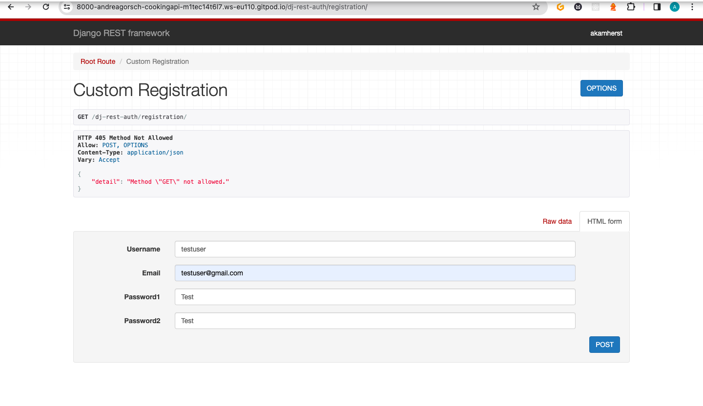
     
    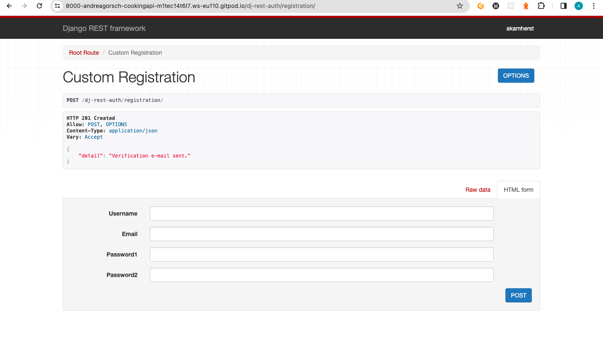

### Login

**User story: As a registered user I can log in so that I can manage my profile and recipes.**

**Expected Result**: Users can login with their credentials and are given feedback in case the login was unsuccessful.

**Actual Result**: Works as Expected

Login

    
     
    

### Login Status

**User story: As a user I can always see if I am logged in or logged out so that I know whether I am capable to use a certain feature with the current status.**

**Comment**: Not applicable for the backend, this is a requirement for the frontend only. Although in the screenshot under Login you can see that the Login is visible on the top right-hand side.

### New Recipe

**User story: As a logged-in user I can post a new recipe so that I can share my unique recipes with the world.**

**Expected Result**: A logged in user can post a recipe.

**Actual Result**: Works as Expected

Recipe Post

    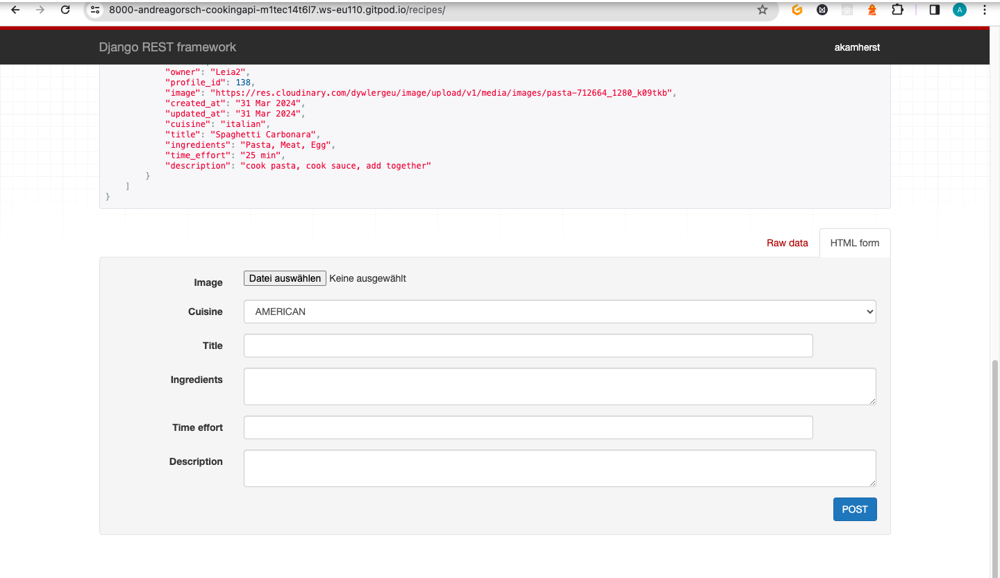
     
    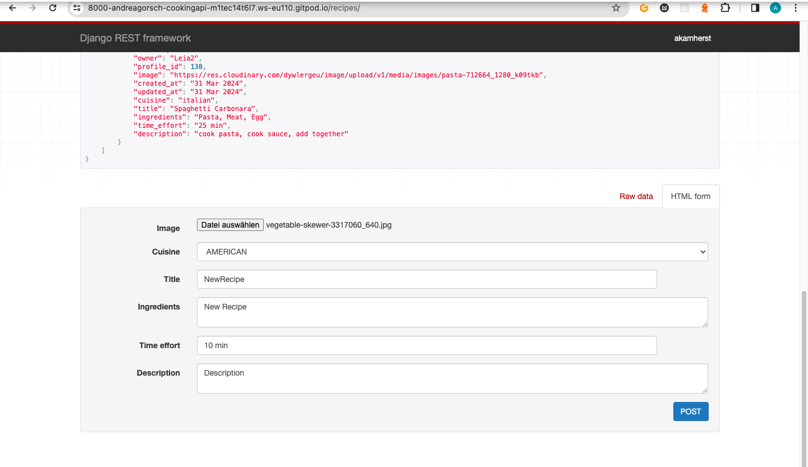
       
    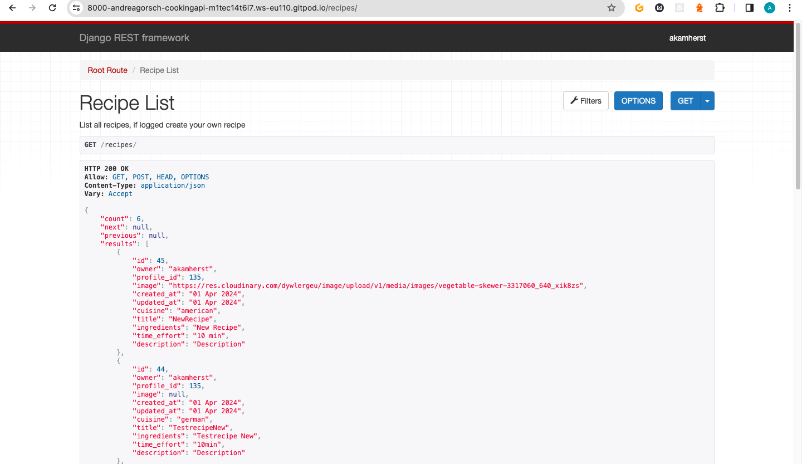

### Recipe Detail

**User story: As a logged-in user I can access the details of a recipe so that I can try it myself.**

**Expected Result**: Recipe Detail View is functional for logged in user.

**Actual Result**: Works as Expected

Recipe Detail

    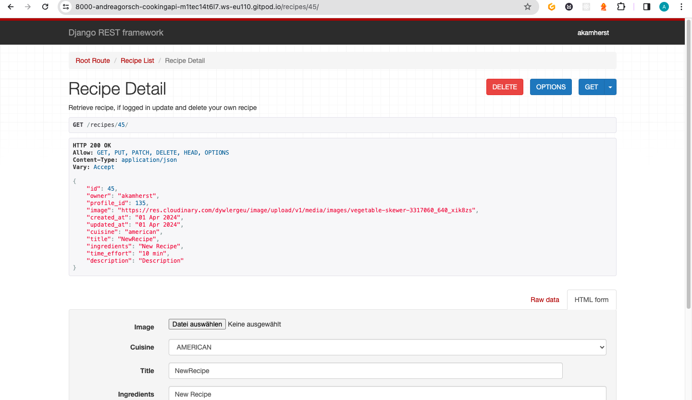

### Recipe List

**User story: As a user I can view a list of recipes that were recently added so that I have an overview of the newest, added recipes.**

**Expected Result**: At the recipes endpoint all recipes are listed to view.

**Actual Result**: Works as Expected

Recipe List View

    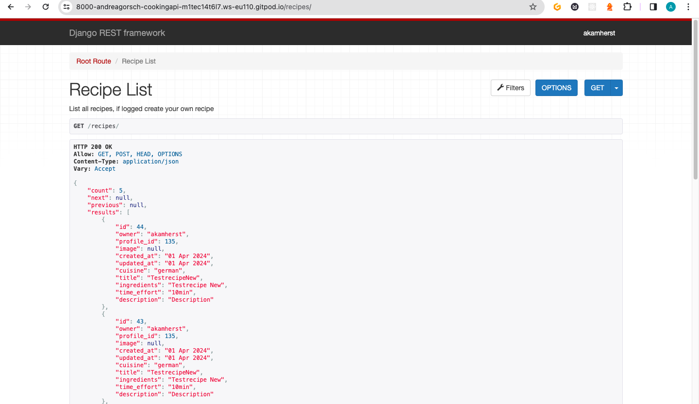

### Search for Recipes

**User story: As a user, I can search for recipes by cuisine(drop down menu), by ingredients, by keywords so that I can find the recipes and chef profiles I am most interested in.**

**Comment**: Since the filtering is only visible in the frontend this can't be tested here.

**User story: As a recipe owner I can edit my recipe title, pic, time effort, ingredients and description so that I can make corrections or update my recipe after it was created.**

**Expected Result**: At the recipe detail view I can edit recipes that I own, and save the changes.

**Actual Result**: Works as Expected

Edit Recipe

    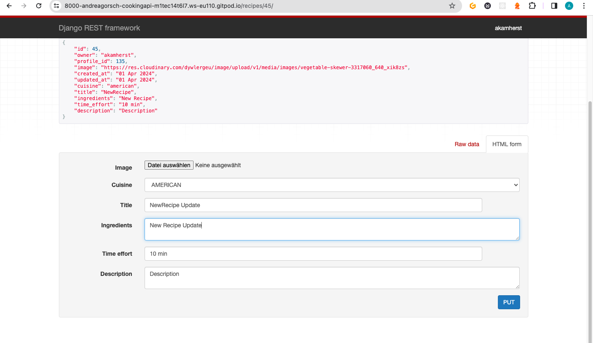
     
    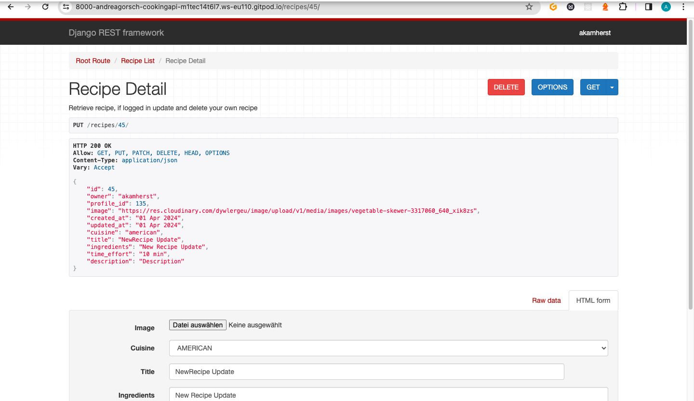

### Delete Recipes

**User story: As a logged in user I can delete my own recipes so that I can get rid of information I don't want to share anymore.**

**Expected Result**: At the detail view endpoint I can delete the recipe, if I own it.

**Actual Result**: Works as Expected

Delete Recipes

    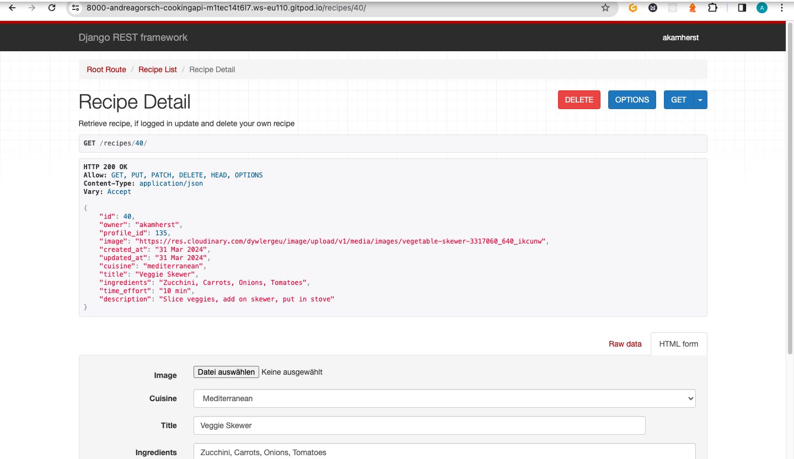
     
    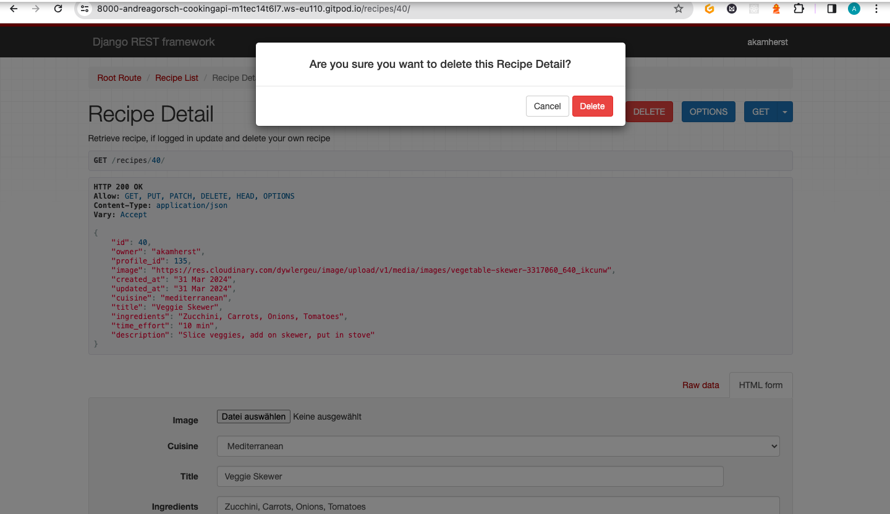

### Profile Update

**User story: As a logged in user I can access my profile page so that I can manage the information about me.**

**Expected Result**: At the profiles endpoint I can update my own profile information.

**Actual Result**: Works as Expected

Profile Update

    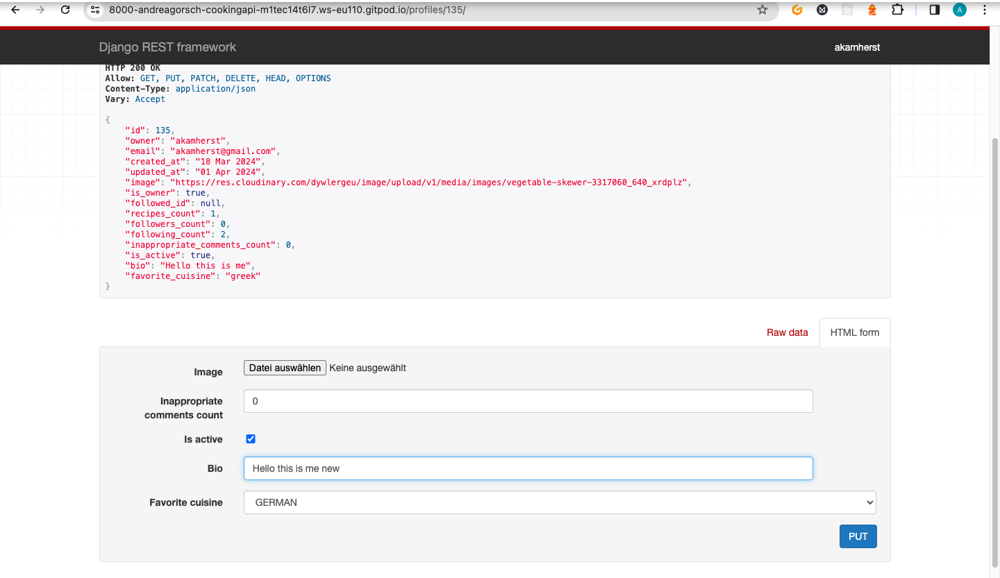
     
    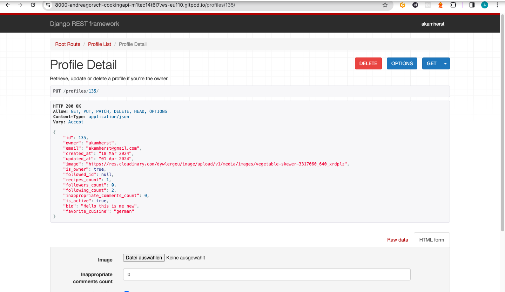

### Fasts Navigation

**User story: As a user I can navigate through pages fast so that I can view content without refreshing the page.**

**Comment**: This is a frontend requirement that can't be tested in the backend.

### Create Comments

**User story: As a logged in user I can create comments so that I can share my thoughts on other chef's recipes.**

**Expected Result**: At the comments endpoint I can choose a recipe and comment on it.

**Actual Result**: Works as Expected

Add a Comment

    
     
    

### Delete Comments

**User story: As a logged-in user I can delete my own comments so that I have full control over my shared content.**

**Expected Result**: At the comment detail endpoint I can delete the comment, if it is my own.

**Actual Result**: Works as Expected

Delete a Comment

    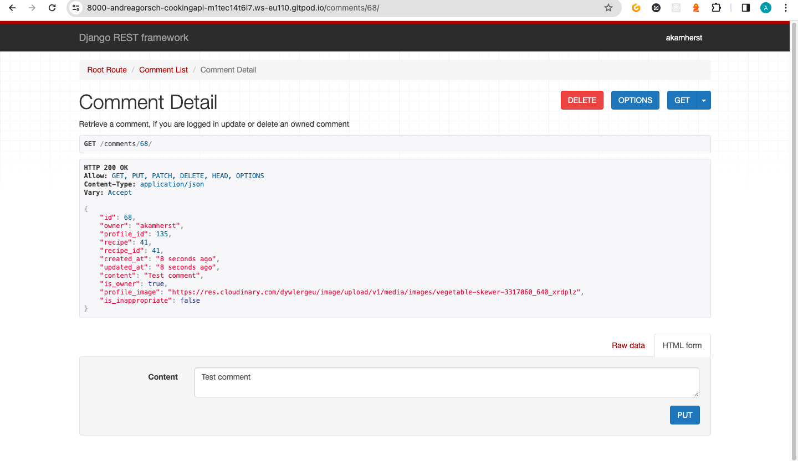
     
    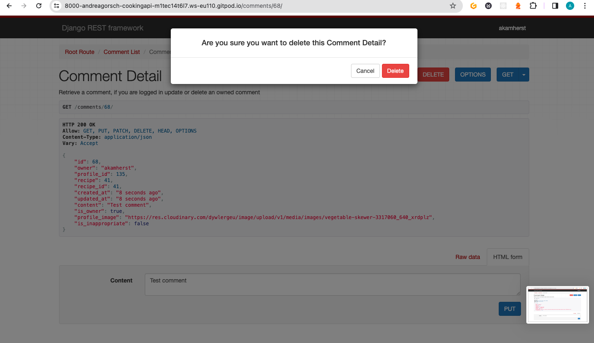
     
     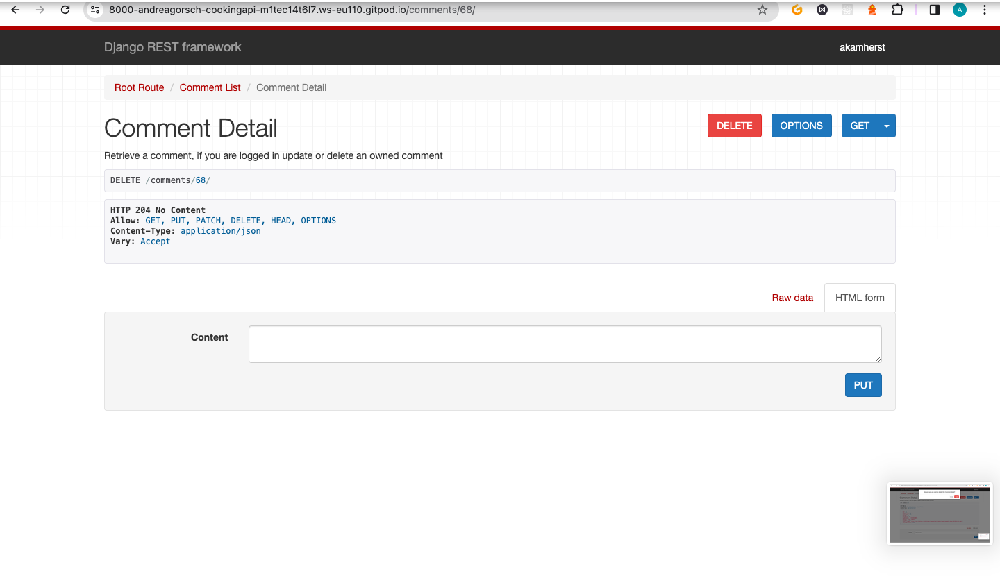

### Mark as Inappropriate

**User story: As a logged-in user I can mark another comment as inappropriate so that I can help keep cyber mobbing and trolling in place.**

**Expected Result**: At the endpoint inappropriate I can mark a comment as inappropriate, if the comment is not my own.

**Actual Result**: Works as Expected

Mark Comment as Inappropriate

    
     
    

### Follow/Unfollow

**User story: As a logged-in user I can follow and unfollow other chef profiles so that I keep up to date with them.**

**Expected Result**: At the follow endpoint I can follow other users, at the unfollow endpoint I can unfollow other users.

**Actual Result**: Works as Expected

Follow and Unfollow Functionality

    
     
    
     
    
     
    
     
    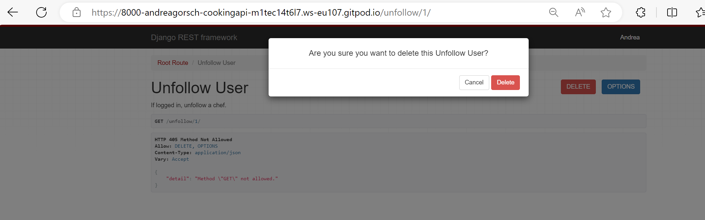
     
    

### Ease-of-Navigation

**User story: As a user, I can navigate through the application intuitively so that I can easily find the features I am looking for.**

**Comment**: This is a frontend requirement that can't be tested in the backend.

### Responsiveness

**User story: As a user, I can access the application from different devices so that I can have a consistent user experience on all devices.**

**Comment**: This is a frontend requirement that can't be tested in the backend.

### User Feedback

**User story: As a user I want to see messages as feedback for my actions within the application so that I can know if my actions were successful.**

**Expected Result**: Registration Form, Login Form and Recipe Create Form are giving user feedback on potential data issues (e.g. size of image in recipe creation form)

**Actual Result**: Works as Expected

User Feedback (Backend Implementations)

    
     
    
      
    

### Email Confirmation

**User story: As a user I can confirm my registration via email so that my data is save and not used in a way I dont want it to be used (e.g. somebody else registers with my email).**

**Expected Result**: The registration endpoint gives feedback about sent registration email confirmation, the email is shown in the terminal and a link leads to the confirmation flow via the backend.

**Actual Result**: Works as Expected

Confirmation Mail

    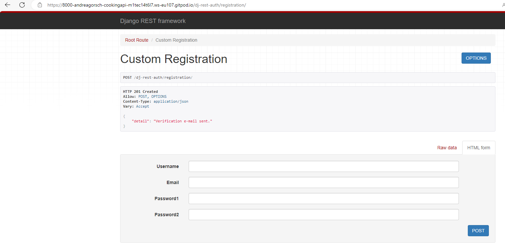
     
    
     
    

# Deployment

The project was deployed to Heroku. A live version of the API can be found at http://cookingapi.herokuapp.com/.

The necessary steps to deploy the project are:

* Clone or fork the repository. For forking it, go to https://github.com/andreagorsche/cooking-api, click on Fork and follow the instructions. For cloning the repository run **git clone https://github.com/andreagorsche/cooking-api.git** in your terminal.

* Create an account at https://cloudinary.com and get your Cloudinary URL from the dashboard by clicking on the URL under API Environment variable.

* Create a PostgreSQL database, for example at https://www.elephantsql.com/. Create an account and after login in, click on Create new instance and follow the instructions. Click on your newly created database and get the URL from the database details.

* Create an account at https://heroku.com and login. Then, start a new app from the Heroku dashboard by clicking on New and then on Create new app.

    * Give your app an available name and choose your region (US or Europe).

    * After creating your app, go to the Settings tab and click on Reveal Config Vars in the Config Vars section.

    * Add the following config vars:

        Name	Value
        ALLOWED_HOSTS	<your deployed heroku API app url> *
        CLIENT_ORIGIN_DEV	<your development environment url> **
        CLIENT_ORIGIN	<your client url>
        CLOUDINARY_URL	<Your cloudinary url>
        DATABASE_URL	<Your database url>
        DISABLE_COLLECTSTATIC	1
        SECRET_KEY	<some random string>
        * Paste the URL without 'https://' or a trailing slash!

** E.g. "http://localhost:3000" for building a React front end app in a local environment. This may differ for your IDE.

 * Click on the Deploy tab and connect the Heroku app to your GitHub repository.

 * Scroll down and choose the branch you want to deploy in the Manual deploy section. Now click on Deploy Branch for the first deployment of the application.

 * After deployment click on View to open your deployed app.

* In case you run into any issues you can access logs by clicking on More and then View logs or you can check the Activity tab for debugging.

# Credits

This project was created based on the Code Institute's Django REST API walkthrough project 'Moments'.

## Additional research and reads

### On Django Signals
https://docs.djangoproject.com/en/5.0/topics/signals/
https://www.geeksforgeeks.org/how-to-create-and-use-signals-in-django/

### Setting Up Email Verification
Send email using Django | How To Send Email With Django | 2024 (https://www.youtube.com/watch?v=iGPPhzhXBFg)

### On Email Verification and custom django adapter
https://stackoverflow.com/questions/62586150/django-allauth-custom-email-verification-url-does-nothing

